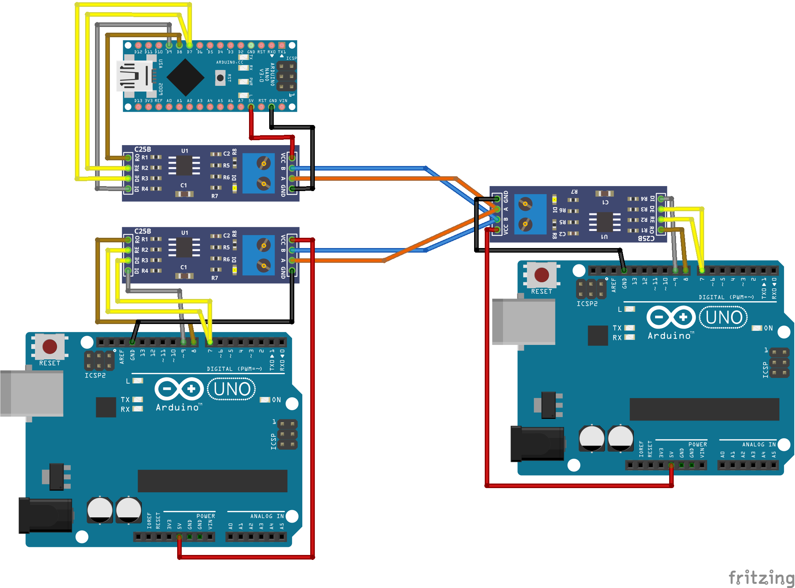

# Simple485
Simple multipoint communication protocol using RS-485 for Arduino.

This library implements simple communication protocol for multiple devices connected to serial [RS-485](https://en.wikipedia.org/wiki/RS-485) port. It includes addressing, error detection and simultaneous transmission prevention.

Tested on Arduino Uno and Arduino Nano.

## Basic Usage

```c++
Simple485 rs485 = Simple485(&Serial, addr);
rs485.send(dst, len, bytes);
rs485.loop();
if (rs485.received() > 0) {
  message = rs485.read();
}
```

## Features

- 1 byte addressing (up to 255 points)
- broadcast address `0`
- transmitting payload up to 255 bytes
- XOR checksum
- simultaneous transmission prevention

### RE/DE pin

Some RS-485 transceivers use [RE and DE pins](https://electronics.stackexchange.com/questions/153500/correctly-using-re-and-de-with-rs485) to turn receiver and transmitter on (RE = receiver enabled, DE = driver enabled). When a pin number provided, Simple485 sets the pin high when transmitting and low otherwise. Connect both RE and DE to the selected pin together.

### Packet format

`(LF) SOH dst src len STX payload ETX crc EOT (LF)`

| Segment | Length   | Description         |
|---------|----------|---------------------|
| dst     | 1 byte   | destination address |
| src     | 1 byte   | source address      |
| len     | 1 byte   | payload length      |
| payload | 2N bytes | encoded payload     |
| crc     | 1 byte   | checksum            |

### Payload code

Payload is encoded to consists of antisymmetric bytes only: byte is separated into two nibbles and each is complemented by its inverse nibble. This makes the payload twice as long.

### Simultaneous transmission prevention

If multiple devices transmit at the same time, packets are corrupted. To avoid this, Simple485 checks whether data is incoming:
If the period since last data arrival is greater than `LINE_READY_TIME` (default 10 ms), protocol starts transmitting its buffered packets. Otherwise, it does nothing until next loop.

Note that if for any reason (e.g. extremely synchronized transmission) the packets are corrupted, the receiver ignores faulty packets, but no retry is implemented.

## Library description


- `Simple485(Stream * serial, uint8_t addr)` constructor, `serial` stream object, `addr` this device's address
- `Simple485(Stream * serial, uint8_t addr, uint8_t pin)` constructor with RE/DE pin (see above)
- `void receive()` process serial buffer
- `void transmitt()` transmit packets in buffer
- `void loop() { receive(); transmitt(); }`
- `void send(uint8_t dst, uint8_t len, uint8_t * bytes)` send bytes of length `len` to destination `dst`
- `void send(Message message)` same as above, variables in struct
- `void send(uint8_t dst, String text)` send text message to `dst`
- `int received()` number of received messages in buffer
- `Message read()` get first message in buffer as struct

`typedef struct Message {uint8_t addr; uint8_t len; uint8_t * bytes;} Message;`

### Testing

Tested with Arduino Uno and Arduino Nano.

